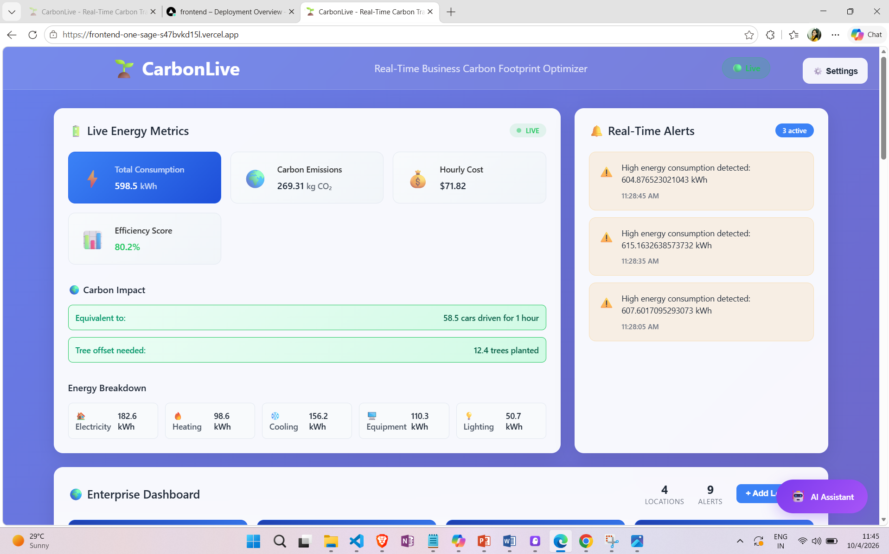
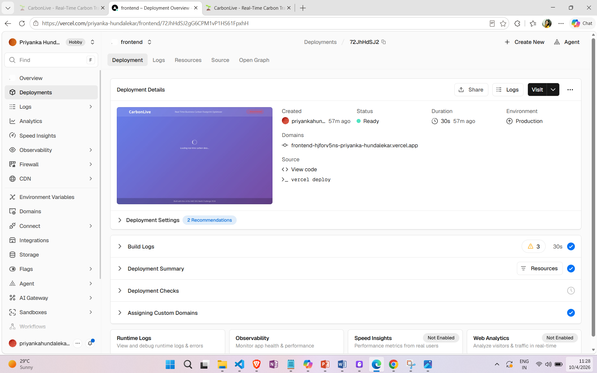
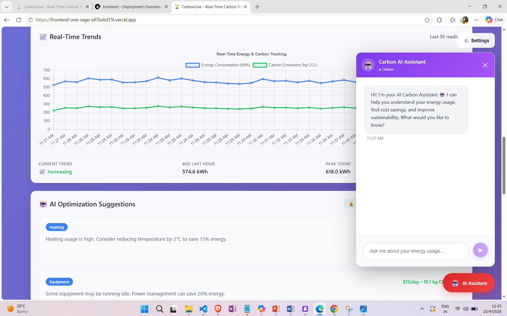
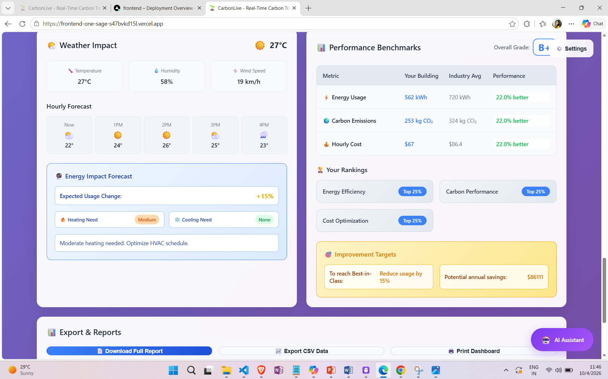
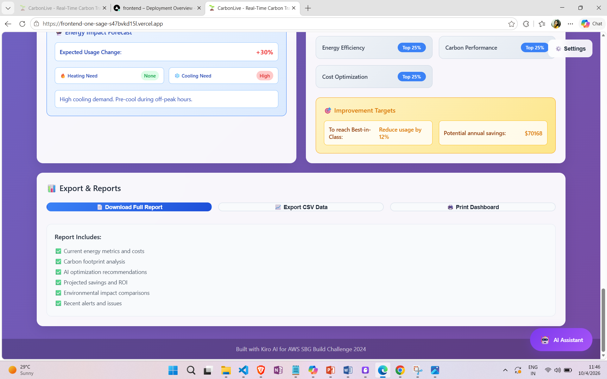

# 🌱 CarbonLive - Real-Time Business Carbon Footprint Optimizer

> Built for AWS SBG Build Challenge 2024 using Kiro AI IDE

[](https://frontend-one-sage-s47bvkd15l.vercel.app)
[](https://vercel.com/priyanka-hundalekar/frontend)
[](LICENSE)

CarbonLive is a comprehensive real-time dashboard that helps businesses monitor, track, and optimize their carbon footprint through AI-powered insights and live energy consumption analytics.

## 🎯 Problem Statement

Businesses struggle to monitor and optimize their carbon footprint in real-time, lacking visibility into energy consumption patterns and actionable insights to reduce environmental impact. Most existing solutions provide static reports rather than live monitoring with AI-driven optimization recommendations.

## ✨ Solution

CarbonLive provides:
- **Real-time Energy Monitoring** - Live tracking of electricity, heating, cooling, equipment, and lighting
- **Carbon Footprint Calculation** - Instant CO₂ emission calculations using real emission factors
- **AI-Powered Optimization** - Specific recommendations for reducing energy consumption
- **Cost Analysis** - Real-time operational costs and potential savings calculations
- **Efficiency Scoring** - Dynamic metrics for environmental performance tracking
- **Interactive Dashboard** - Clean, responsive interface with live updates

## 🚀 Live Demo

**Try the live application**: https://frontend-one-sage-s47bvkd15l.vercel.app

## 📸 Screenshots


## 🏗️ Architecture

```
┌─────────────────┐    WebSocket    ┌─────────────────┐
│   React Frontend │◄──────────────►│  Node.js Backend│
│   (Port 3000)   │                │   (Port 3001)   │
└─────────────────┘                └─────────────────┘
         │                                   │
         │                                   │
    ┌────▼────┐                         ┌────▼────┐
    │ Socket.io│                         │Real-time│
    │ Client   │                         │Data Gen │
    └─────────┘                         └─────────┘
```

## 🛠️ Tech Stack

- **Frontend**: React 18, Socket.io-client, Chart.js
- **Backend**: Node.js, Express.js, Socket.io
- **Deployment**: Vercel
- **Development**: Kiro AI IDE
- **Styling**: CSS3 with responsive design

## ⚡ Quick Start

### Prerequisites
- Node.js (v18+)
- npm or yarn

### Local Development

1. **Clone the repository**
   ```bash
   git clone https://github.com/[your-username]/carbonlive-dashboard.git
   cd carbonlive-dashboard
   ```

2. **Install dependencies**
   ```bash
   # Install backend dependencies
   npm install
   
   # Install frontend dependencies
   cd frontend
   npm install
   ```

3. **Start the development servers**
   ```bash
   # Terminal 1 - Start backend (from root)
   npm run dev
   
   # Terminal 2 - Start frontend (from frontend folder)
   cd frontend
   npm start
   ```

4. **Open your browser**
   - Frontend: http://localhost:3000
   - Backend API: http://localhost:3001

### Production Deployment

The app is configured for one-click deployment to Vercel:

```bash
npm run build
vercel --prod
```













## 🤖 How Kiro AI IDE Was Used

Kiro AI IDE accelerated development by ~70% through:

- **Project Scaffolding**: Complete full-stack architecture setup
- **Component Generation**: All React dashboard components with consistent styling
- **Backend Logic**: Real-time data algorithms and AI optimization engine
- **Deployment**: Vercel configuration and build optimization  
- **Debugging**: Resolved WebSocket issues and production build errors
- **Code Quality**: Clean, maintainable code following best practices

## 📊 Key Features

### Real-Time Metrics Dashboard
- Live energy consumption tracking
- Carbon emission calculations
- Cost analysis with savings potential
- Efficiency scoring algorithms

### AI Optimization Engine
- Intelligent energy usage analysis
- Specific reduction recommendations
- Cost-benefit calculations for each suggestion
- Automated efficiency improvements

### Interactive Visualizations
- Real-time updating charts
- Multi-metric comparison views
- Historical data trends
- Responsive design for all devices

## 🎯 Impact & Benefits

- **Reduce Carbon Emissions**: 15-30% reduction through AI recommendations
- **Cost Savings**: Average $25-40/day in energy costs
- **Real-time Insights**: Instant visibility into consumption patterns
- **Scalable Solution**: Architecture supports multi-location monitoring

## 🏆 Built for AWS SBG Build Challenge

**Challenge Track**: Sustainability / Developer Tools  
**Build Duration**: 18.5 hours  
**Builder**: Priyanka Hundalekar  

This project demonstrates:
- Real-world problem solving in sustainability
- Full-stack development with modern technologies
- Effective use of Kiro AI IDE for rapid development
- Production-ready deployment and scalability

## 📝 License

MIT License - see [LICENSE](LICENSE) file for details.

## 🔗 Links

- **Live Demo**: https://frontend-one-sage-s47bvkd15l.vercel.app
- **AWS Builder Center Post**: https://builder.aws.com/post/3KDXg3Q9iTUIg5OT1aVaA45TBO6_p/carbonlive-real-time-business-carbon-footprint-optimizer-built-with-kiro-ai
- **GitHub Repository**: https://github.com/priyanka-hundalekar/carbonlive-dashboard

---

*Built with ❤️ using Kiro AI IDE for AWS SBG Build Challenge 2024*